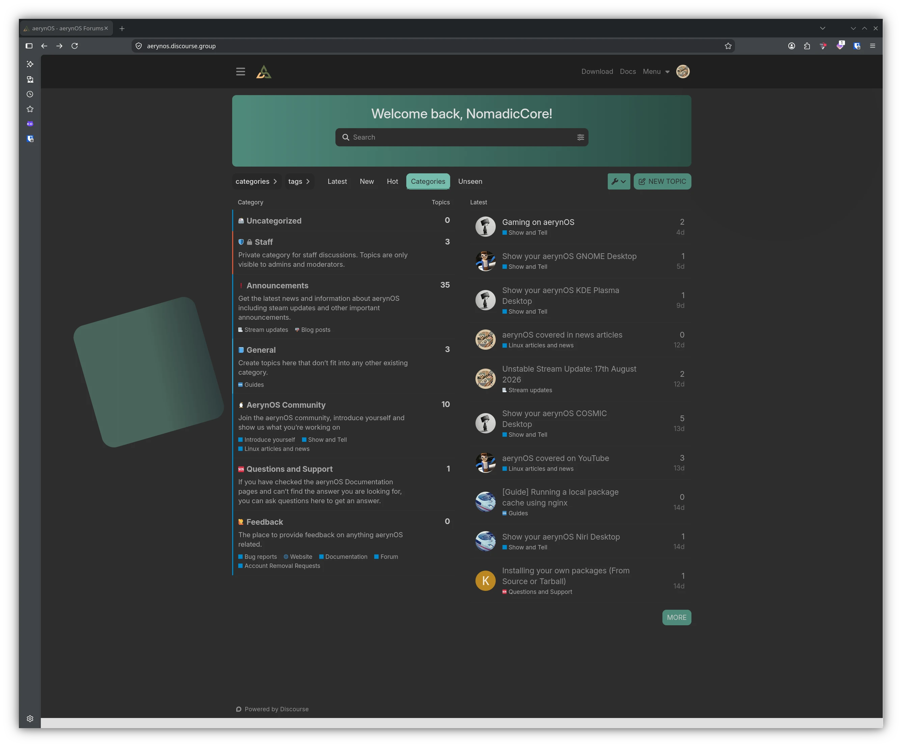
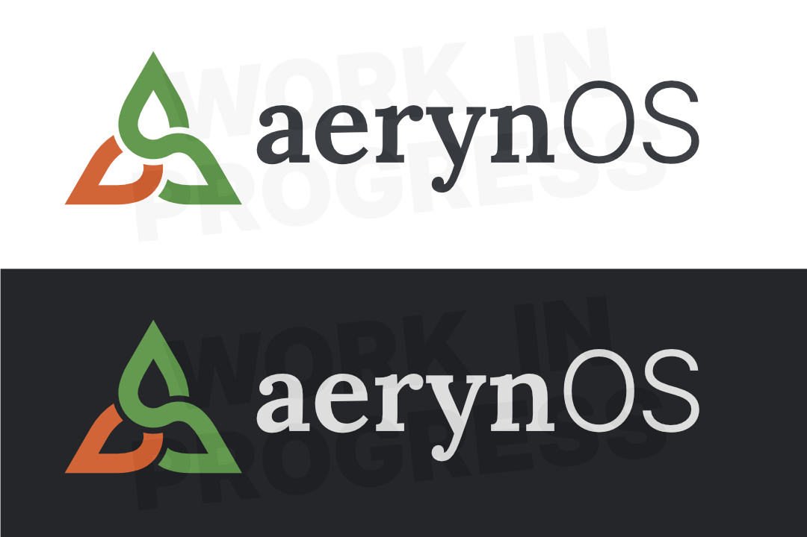

import { Aside } from "@astrojs/starlight/components";

Whilst August is a holiday month around Europe, it's safe to say it's been a very busy month around the project, with a lot of progress made across various core tooling repositories.

Following on from our Versioned Repositories phase 2 work that we landed last month, we are developing `moss` on multiple fronts. [tarkah](https://github.com/tarkah) has supplemented our current hardlink driver approach with a reflink strategy for filesystems that support it, along with working on an in-progress development sprint to eventually deliver an EROFS metadata-image based approach that will be fully filesystem agnostic. [Fabio](https://github.com/livingsilver94) is working on moss' command tree, reorganising the commands we already have but also looking forward to the command functionality we will eventually want to have available. Lastly, [Jonathan](https://github.com/otherJL0) is also working towards improved search and shell completion functionality that will make `moss` easier to interact with for both users and packagers alike.

[Joey](https://github.com/joebonrichie) has delivered a number of performance-related improvements to `boulder`, making packaging quicker and also offering additional optimisation techniques such as BOLT for key packages.

On the distribution side, [Reilly](https://github.com/reillybrogan) has led our expanding packaging team through a repository-wide rebuild to ensure ABI sanity and protect against potential bit rot. Ultimately, this means less risk of broken packages or systems for our early adopters.

In a separate work stream, staff member [Bryan](https://github.com/bhh32/) is working on a new TUI-based lichen installer that is substantially improved from the current lichen installer that we offer. We are developing it openly with updated versions being shared in our [Zulip server](https://aerynos.zulipchat.com/). Bryan is taking on board feedback and iterating on the design and functionality with the aim of it being included in a future ISO. Key improvements include automatic disk formatting, system-model-driven installs, btrfs as a root partition option and generally a much more refined TUI navigation experience.

Staff members [Alice](https://github.com/CookieSource/) and [NomadicCore](https://github.com/NomadicCore) have worked on a new [Discourse forum](https://aerynos.discourse.group/) that will replace our GitHub Discussions forum. We are thankful to Discourse for sponsoring the project with this server, and to our community members who have been giving us feedback on the layout. It is now ready for wider use by our community.

Finally, we're continuing to refine the project's branding with a slight tweak to the project name from AerynOS to aerynOS along with tweaks to logo colours and fonts.

## What's new in the distro

### Packaging and stack updates

The wider aerynOS team has expanded with a "Trusted Maintainers" role that sits under staff. We have [Jaredy899](https://github.com/Jaredy899) and [K1ngfish3r](https://github.com/K1ngfish3r) currently operating in this role and primarily supporting reviews and approvals in our [recipes repository](https://github.com/aerynOS/recipes). 

Their addition to the wider team has made a substantial impact on day-to-day package maintenance and is helping ensure aerynOS stays current. In addition, we have implemented a new [Packaging Policy](https://github.com/aerynOS/recipes/blob/main/PACKAGING_POLICY.md) and new Issue and PR templates to support users, maintainers and staff to efficiently and effectively manage our recipes repository.

Package highlights for this month include:

- CMake 4.4.3
- COSMIC DE 1.7.0
- Ccache 4.14
- Faugus Launcher 2.2.1
- Firefox 154.0.1
- GCC 16.2.0
- Gamescope 3.16.26
- Glibc 2.43
- KDE Frameworks 6.29.0
- KDE Gear 26.08.0
- KDE Plasma 6.7.4
- Linux LTS 6.18.48
- Linux gaming 7.2.2
- Linux stable 7.1.12
- Mesa 26.2.1
- Neovim 0.12.5
- NetworkManager 1.58.1
- Node.js 24.20.0
- PHP 8.5.10
- QEMU 11.1.1
- Qt 6.11.2
- Rust 1.98.0
- Thunderbird 154.0
- VS Code 1.135.0
- Wine 11.16
- Youki 0.7.0
- ZFS 2.4.4
- Zed 1.17.2
... along with sundry additions and updates.

## Infrastructure and Tooling Updates

### `moss` and EROFS metadata images

We mentioned EROFS metadata-only images that would operate in a read-only capacity. Work is still ongoing in this area, however in the meantime, we have delivered a more general filesystem tree abstraction within `moss`. This has then been supplemented with a [reflink](https://linuxjunkies.org/glossary/reflink) approach for the filesystems that support it.

<Aside title="Why add reflink support?">
Our recommended root filesystem, XFS, supports reflinks. As we were designing our `fstree` driver API, we realised that it would be trivial to check for reflink support and use it if available.

This gives us the benefit of being able to write multiple, deduplicated copies of the same file with independent permissions and ownership for each, and it also ensures that we don't mangle the actual underlying CAS files if something writes to them.
</Aside>

The new `fstree` driver API separates the concept of a filesystem tree from the mechanism used to create and manage it. Our existing native implementation now works through this abstraction, while an overlay-image driver is also being developed and tested.

This is important groundwork for the EROFS metadata-image approach, as it allows `moss` to work with different filesystem tree approaches without coupling the higher-level state-management code to one particular approach.

The EROFS work is still very much under development and is **not yet delivered**. There is still testing and integration work to complete before we can consider making it available to users.

### `moss` command tree

The work to restructure the `moss` command line has continued throughout the month and is currently awaiting PR review before being merged.

We're progressively moving the CLI over to `clap_derive`, allowing the command hierarchy to be represented directly through the command structures rather than being manually assembled.

A number of commands will be converted, including `repo`, `pkg`, `search`, `state`, `sync`, `cache` and `boot`.

We will also be able to simplify some of the existing command behaviour as part of this work. The separate `help` and `version` subcommands are being removed in favour of the conventional command-line handling provided by clap.

The work is being tracked in [PR #687](https://github.com/aerynOS/os-tools/pull/687).

While this is primarily an internal refactoring at present, it gives us a much cleaner foundation for extending moss' command line as more functionality is added in the future.

### `moss` search functionality

The work on moss' search functionality has also continued in [PR #788](https://github.com/aerynOS/os-tools/pull/788).

The current focus is on making package and file searching easier to understand and use, with a more coherent `moss search` interface rather than requiring users to know which specific search command they need.

This approach is exploring how package, provider and file searches should be exposed through the command line while retaining the ability to perform more specific searches where required.

This is still being refined, and we're using the current development work to make sure the resulting interface is useful for both everyday users and packagers while ensuring it links back into the `moss` command tree work highlighted above.

### `boulder` performance improvements

We've continued making improvements to `boulder`, our package build tool.

`boulder` can now emit multiple packages concurrently allowing recipes which produce several packages to make better use of modern multi-core systems while still limiting the amount of concurrent work so that CPU resources remain available for compression.

We've also updated the BOLT optimisation configuration used during package builds. This includes moving from the deprecated `hfsort+` option to `cdsort` and removing obsolete optimisation options.

Additional LLVM tuning flags have also been added as part of our continuing work to make better use of the available compiler and linker tooling.

These changes aren't necessarily visible to users directly, but they help improve the efficiency of the infrastructure we use to build the distribution.

## Wider Project Updates

### The global recipes rebuild

One of the largest pieces of work in the recipes repository over the last month has been our global package rebuild. We last conducted this exercise around May to June last year when we transitioned from our old Dlang-based infrastructure to our newer Rust-based infrastructure.

We had planned to do repository-wide rebuilds on a slightly more frequent basis and had actually mentioned it in our [February project update](https://aerynos.com/blog/2026/02/28/february-2026-project-update/#invasive-toolchain-and-full-repo-rebuilds), however other development work took priority. We have now rebuilt all packages across the repository to establish a much more consistent ABI baseline as our current tooling does not automatically ensure ABI sanity as a feature; this is currently managed through ingrained knowledge in our core packagers. This is particularly important as we continue evolving aerynOS's underlying system libraries and toolchain. Rather than having a mixture of packages built against different generations of dependencies, we want to reach a point where the repository has a well-defined and coherent baseline.

With over 1700 recipes each producing one or more packages, there has been a lot of churn in the repository, which also serves as another stress test for our infrastructure. We are happy to say that it has passed with flying colours.

### Lichen TUI installer

The new TUI-based version of lichen, our installer, has made substantial progress over the last month. The work is currently being developed on the `tui` branch of the lichen-installer repository and represents a significant rewrite of the installer interface and underlying installation flow.

As part of the rewrite, we've added the installation and summary screens, installation plumbing, networking functionality, account configuration, storage and filesystem selection, remote KDL fetching and a number of other pieces required to make the installer usable end-to-end. One big feature we think early adopters will appreciate is the ability to install aerynOS to a btrfs partition!

We've also spent considerable time hardening the installer. This includes improvements around Polkit, ESP and XBOOTLDR handling, password hashing and various installation-flow issues.

The new installer is now being openly tested by members of our community, with development versions being made available through our [Zulip server](https://aerynos.zulipchat.com/). This testing is particularly valuable because we're now able to get feedback from people using the installer on real hardware rather than relying solely on internal testing.

There is still feedback from this testing that needs to be worked through, and we continue to iterate on the codebase until it is ready to be included in a future aerynOS ISO.

Until the new lichen-installer is ready, the current ISO (with the old installer) remains the officially supported way to install aerynOS. We do welcome early adopters to try out the new installer, but please be aware that it is being actively developed and should be treated as development code.

  <iframe
    src="https://exquisite.tube/videos/embed/v7P2YX6719hEvxTZFi8ZC6"
    style="position: absolute; width: 100%; height: 100%; left: 0; top: 0;"
    width="1280"
    height="720"
    frameborder="0"
  ></iframe>

### Our new Discourse Server

We have mentioned in multiple previous blog posts how we would like to reduce our reliance on GitHub. Whilst our assessment of Codeberg will run in the background via our website development work stream, Codeberg does not have a comparable feature to GitHub Discussions. As such, we looked at our wider options and found Discourse to be a good option for our needs and a forum platform that is fairly widely used within the wider open source community.

The Discourse team were kind enough to sponsor the project with a free hosted instance, which we have gladly accepted.

Over the course of the last month, we have worked with a number of our Trusted Contributors to start using the forum and to provide feedback. We believe the forum is now ready for wider public use and can continue to iterate on the design as we get more familiar with it.

One area of feedback has been a concern that having a more traditional forum on top of our Zulip server may end up splitting the community between two platforms and/or give users two places to "keep up" with aerynOS. We hear the feedback but are also conscious that different users will have different preferences on how they wish to interact with the project. If in the medium to long term, we feel that maintaining two community locations isn't beneficial, we can always adapt our approach again.

You can find the Discourse server [here](https://aerynos.discourse.group/). Sign up, look around and get involved!

### Branding and visual identity

During our [April blog post](https://aerynos.com/blog/2026/04/30/rebranding-upgrading-and-wallpapering-aerynos-april-glow-up/) we launched our new logomark, moving away from our older LLM-created A symbol. As the project continues to evolve, and as new members with design expertise join our community, we are continuing to refine our branding.

One of the more visible changes is a transition from `AerynOS` to `aerynOS`. We are working through our various repositories to ensure consistency with the new spelling but this will take some time. Most of the high-visibility areas, such as our website, have already been transitioned.

Concurrently, relatively new contributor [Nona](https://codeberg.org/nona) has been working with us on refining the project's visual identity. The existing triquetra logo is **not** being replaced. Instead, we are refining the shades of orange and green used by the project and working through the choice of font and kerning to bring the various elements of our branding together more consistently. It's important to note part of this fine-tuning is also to consider various accessibility needs such as different forms of colour blindness. We take accessibility considerations fairly seriously within this project.

This is a relatively small piece of work compared with the engineering happening elsewhere in the project, but completing these details will allow us to finally bring the visual side of the aerynOS rebrand to a more finished state.

### Website development and code licensing

We have ramped up progress on our website redesign over on [Codeberg](https://codeberg.org/aerynOS/dotcom) in the last month. Whilst not yet ready to launch, it is nearing "completion", although we may end up launching the site in stages.

The goal is to eventually deliver a single site that covers what both our [dotcom](aerynos.com) and [dotdev](aerynos.dev) currently cover. However, we may split this into two transitions, with the main site transitioning first and our dotdev documentation site moving over at a later stage once we have done a full review of the documentation and brought it in line with the current state of the project.

One important point to note is that we have created a new repository for this work. We had originally created a brand new repository for the Hugo/Hextra redesign but that meant that we had not copied over authorship history from the existing website. We have now forked our existing website and subsequently overlaid our new Hugo/Hextra work on top to maintain as much of the git history as we can.

As part of our website work, we noted that there wasn't any licence attributed to the code. We had a look at what is considered standard practice in this area for other Linux distributions, as well as the licences used by Astro, Hugo and Hextra, and have decided on licensing our website code as MIT, our blog posts as CC BY-ND 4.0 and our documentation as CC BY-SA 4.0. This has already been applied to our current websites and will carry over to our new site once it is launched. 

  <iframe
    src="https://exquisite.tube/videos/embed/89tCdq7JsRB9qsFxTBhDsL"
    style="position: absolute; width: 100%; height: 100%; left: 0; top: 0;"
    width="1280"
    height="720"
    frameborder="0"
  ></iframe>

## Next Steps

There are several major pieces of work already in progress which will continue into the next month.

The EROFS metadata-image work will continue towards a production-ready implementation, with the `fstree` abstraction and overlay-image driver providing the foundation for this work.

The moss CLI refactor will continue through [PR #687](https://github.com/aerynOS/os-tools/pull/687), while [PR #788](https://github.com/aerynOS/os-tools/pull/788) will continue to develop the new search experience.

We're also expecting the new TUI version of lichen to go through additional rounds of development based on the feedback from community testing. Once the outstanding issues have been addressed and the installer has received sufficient testing, we can begin looking towards including it in a future ISO.

There is still plenty to do, but the work across `moss`, `boulder`, `lichen` and the recipes infrastructure is increasingly building on the foundations we have established within the project to date.

## Supporting the project

If you would like to support the project, you can do this in multiple ways. You can help with documentation, supporting our website redesign in Hugo/Hextra, get involved with deeper code development or join us in our [Zulip server](https://aerynos.zulipchat.com/)r and help us grow our community!

Outside of this, you can also help support the project financially through one of our supported sponsorship platforms.

  <a style="font-weight: bold; color: white; background-color: #626f47ff; padding: 10px 20px; text-decoration: none; text-align: center; border-radius: 5px;" href="/sponsor/">
    Sponsor aerynOS
  </a>

We are always open to engagement with hardware vendors and infrastructure partners around the open source community. We have been lucky enough to engage with some very cool businesses to provide hardware or service solutions sponsorship. If you would like to get in touch to discuss any sponsorship opportunities, please reach out to us at [contact@aerynos.com](mailto:contact@aerynos.com).

## Thank You!

We are very grateful for your support, be it financial or via project contributions in the form of carefully written bug reports, code contributions, design contributions, documentation updates, general feedback, package updates and overall enthusiasm around the project.

We hope that you will continue showing enthusiasm for our project, and that you will want to get involved in whichever way, shape, or form works for you!
